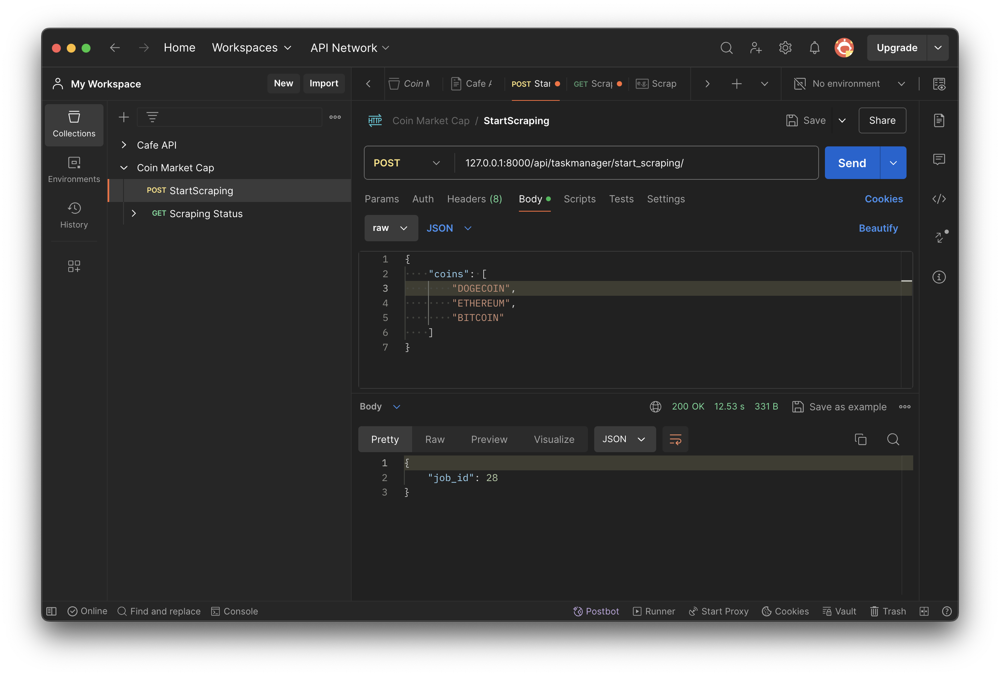
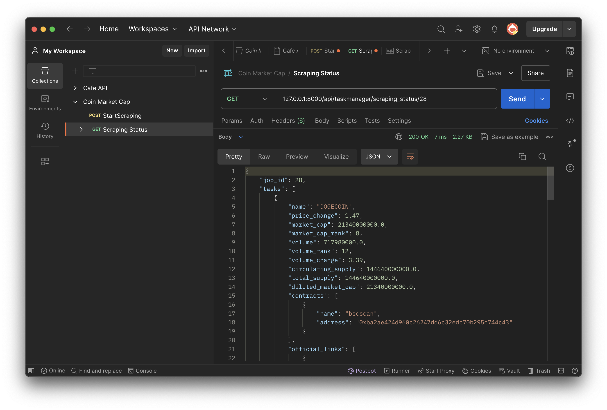
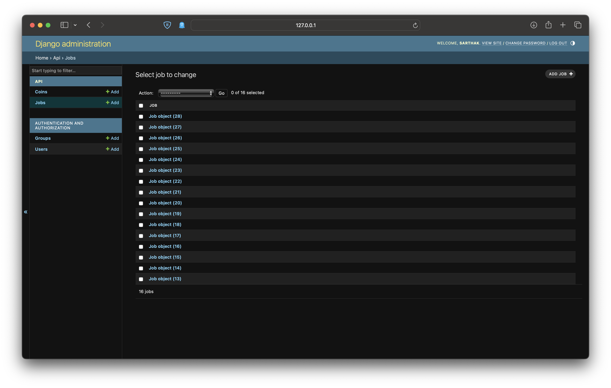
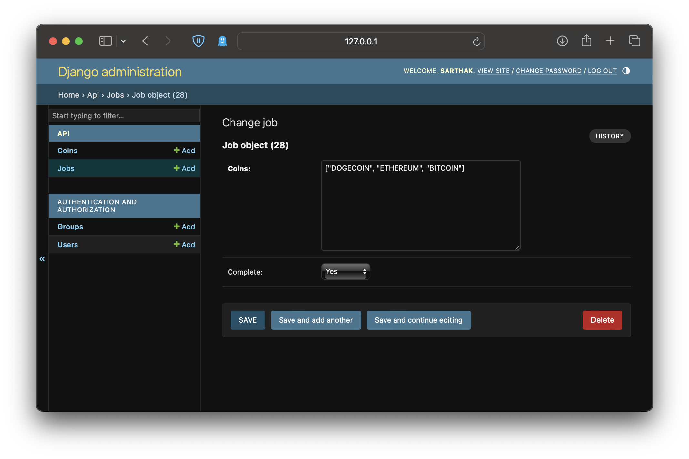
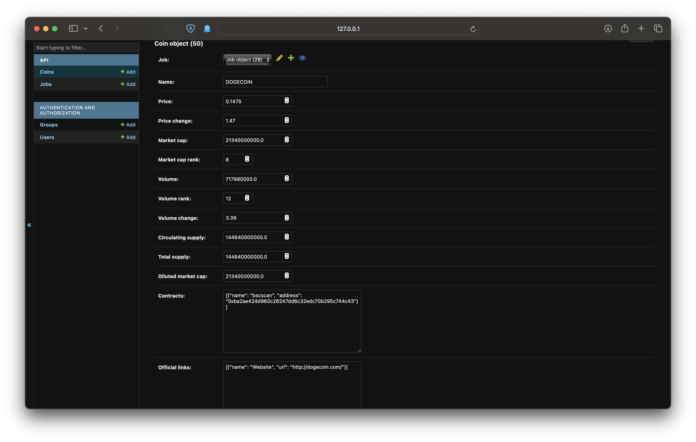
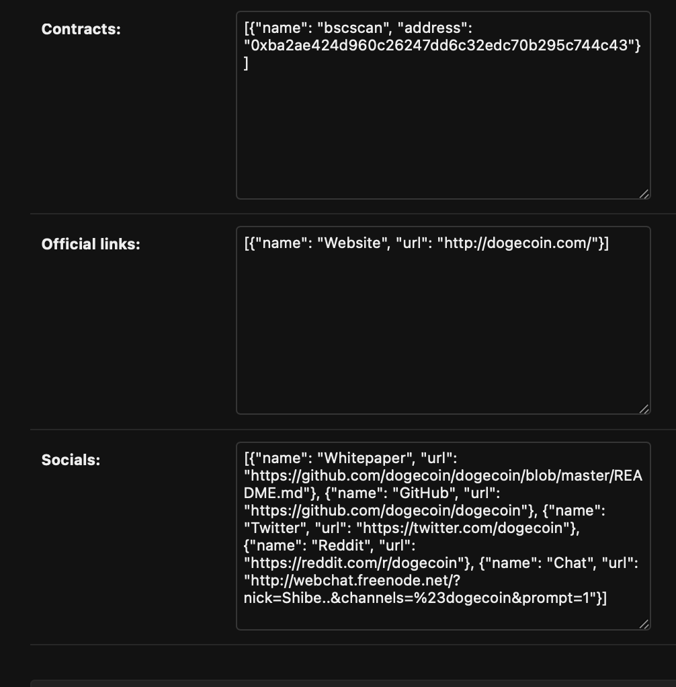

# CoinMarketCap API

This project is a web scraper designed to collect cryptocurrency data from CoinMarketCap and save it to a Django-based backend. The data includes price, market cap, volume, circulating supply, total supply, and more. The project also includes an API to retrieve the collected data.

## Table of Contents

- [Installation](#installation)
- [Usage](#usage)
- [API Endpoints](#api-endpoints)
- [Project Structure](#project-structure)
- [Technologies Used](#technologies-used)
- [Contributing](#contributing)
- [License](#license)

## Installation

### Prerequisites

- Python 3.8+
- Django
- Selenium
- Openpyxl

### Setup

1. **Clone the Repository**

   ```sh
   git clone https://github.com/sarthakghere/coinmarketcap-api.git
   cd coinmarketcap-api
   ```

2. **Create and Activate Virtual Environment**

   ```sh
   python -m venv venv
   source venv/bin/activate  # On Windows use `venv\Scripts\activate`
   ```

3. **Install Dependencies**

   ```sh
   pip install -r requirements.txt
   ```

4. **Setup Django**

   ```sh
   cd mysite
   python manage.py makemigrations
   python manage.py migrate
   python manage.py createsuperuser
   ```


5. **Run the Django Server**

   ```sh
   python manage.py runserver
   ```

## Usage

### Scraping Data

To start the scraping task, send a POST request to the `/api/taskmanager/start_scraping` endpoint with a list of coins.

**Example Request:**

```json
POST /api/taskmanager/start_scraping
{
    "coins": ["BITCOIN", "ETHEREUM", "DOGECOIN"]
}
```

### Checking Task Status

To check the status and get results of the scraping task, send a GET request to the `/api/taskmanager/scraping_status/<task_id>` endpoint.

**Example Request:**

```sh
GET /api/taskmanager/scraping_status/<task_id>
```

## API Endpoints

- **POST /api/taskmanager/start_scraping**: Start scraping data for the specified coins.
- **GET /api/taskmanager/scraping_status/<task_id>**: Get the results of the scraping task.

## Technologies Used

- **Backend**: Django, Django REST Framework
- **Web Scraping**: Selenium, BeautifulSoup
- **Excel Handling**: Openpyxl

## Example
**Postman POST Request**


**Postman GET Request**


**Job Table in Django Admin Panel**


**Job Inforemation Created Using Postman**


**One of the coins in the list of job with id 28**


**The API extracts the links in the following way**


This README provides an overview of the project, installation instructions, usage examples, API endpoint and other relevant information to get started with the CoinMarketCap Scraper project.